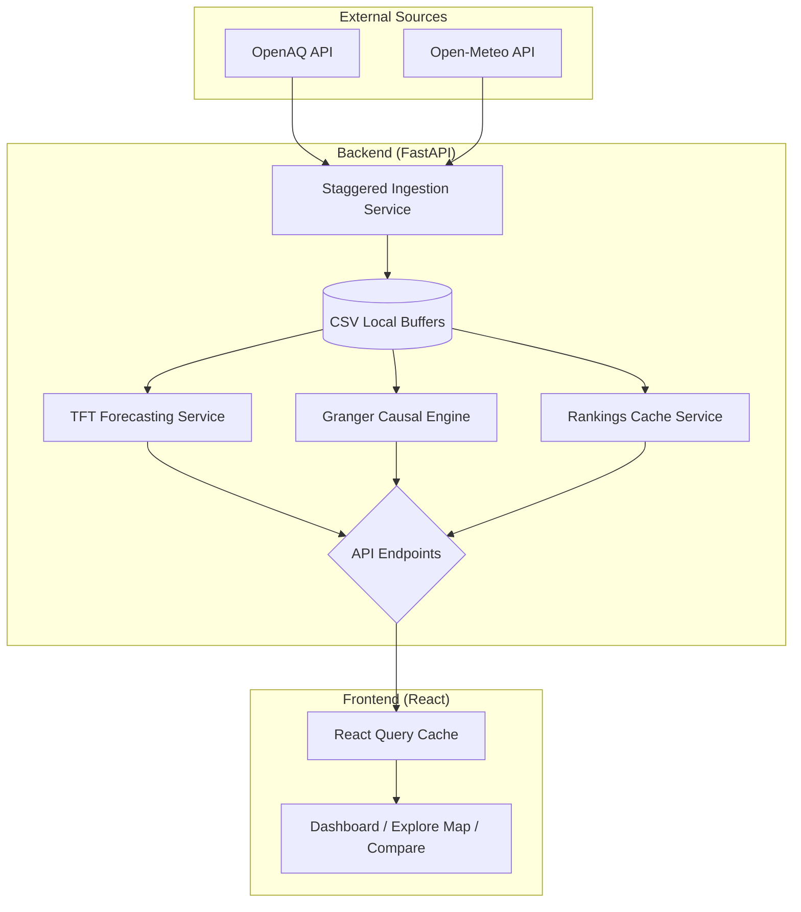

# Aerolytics: Advanced Urban Air Quality Intelligence Platform
## Technical Architecture & Research Methodology

### 1. Abstract
Aerolytics is an integrated environmental intelligence system designed to monitor, forecast, and analyze air quality across 23 major Indian cities. By combining **Temporal Fusion Transformers (TFT)** for predictive modeling and **Granger Causality** for source attribution, the platform provides actionable insights into the complex dynamics of urban pollution. This document details the end-to-end architecture, from low-level data ingestion to high-level visualization.

---

### 2. Technological Stack

#### 2.1 Backend (Data & ML Engine)
| Layer | Technologies |
| :--- | :--- |
| **Language** | Python 3.10+ |
| **API Framework** | FastAPI (ASGI) |
| **Deep Learning** | PyTorch, PyTorch Forecasting (TFT Model) |
| **Statistical Analysis** | Statsmodels (Granger Causality), NumPy |
| **Data Manipulation** | Pandas (Time-series processing) |
| **Task Scheduling** | APScheduler (Background workers) |
| **Server** | Uvicorn (Production worker) |

#### 2.2 Frontend (Client Application)
| Layer | Technologies |
| :--- | :--- |
| **Core Framework** | React 19 (Vite Build System) |
| **Styling** | Tailwind CSS 4.0 (Vibrant Design System) |
| **State Management** | TanStack React Query v5 (Data caching & sync) |
| **Maps & GIS** | Leaflet, React-Leaflet |
| **Charts & Viz** | Recharts (Area, Bar, Radar, Donut) |
| **Animations** | Framer Motion (Micro-interactions) |
| **Routing** | React Router 7 |

---

### 3. System Architecture

---

### 4. Backend Implementation: Detailed Analysis

#### 4.1 Hybrid Data Strategy
The system adopts a "Local-First" buffering strategy. Data fetched from IoT sensors is persisted into **City-Specific CSV Buffers**. This serves three purposes:
1. **Latency Reduction**: Serves data at sub-millisecond speeds.
2. **Persistence**: Maintains a 24-hour sliding window required for ML encoder context.
3. **Data Cleaning**: Clamps negative values, handles missing indices, and performs time-alignment.

#### 4.2 Machine Learning: Temporal Fusion Transformer (TFT)
Unlike standard RNNs or Transformers, the TFT is optimized for real-world multi-variate time series:
- **Feature Intersection**: The model ingests **Static Metadata** (City location), **Time-Varying Knowns** (Weather Forecasts), and **Time-Varying Unknowns** (Pollution history).
- **Quantile Regression**: Instead of a "point prediction," the model generates a range ($P_{10}, P_{50}, P_{90}$), allowing the frontend to visualize a **Confidence Band** (Forecast Uncertainty).
- **Recursive Multi-Horizon**: For a 24-hour forecast, the model recursively feeds its $T+1$ prediction as input for $T+2$, ensuring consistent auto-regressive behavior.

#### 4.3 Statistical Attribution: Granger Causality
The Causal Engine identifies directional drivers of pollution (e.g., does $Wind \to PM_{2.5}$?).
- **Vector Autoregression (VAR)**: The system tests if the history of Temperature or Humidity statistically improves the forecast of $PM_{2.5}$.
- **Significance Mapping**: Logarithmic scaling converts statistical P-values into human descriptors like "Extremely Strong Link," providing interpretable science to non-experts.

---

### 5. Frontend Architecture: Advanced Visualization

The frontend is designed around **Exploratory Environmental Analysis**.

#### 5.1 Component-Based Design
- **`AQICard.jsx`**: A real-time data visualizer using dynamic HSL color scales to reflect AQI categories.
- **`ForecastChart.jsx`**: Implements a unique **Visual Bridge**. Because model predictions at $T=0$ can slightly differ from real sensors, a linear interpolation algorithm smooths the graph over a 4-hour window to prevent jarring "cliffs."
- **`PollutantRiskRadar.jsx`**: Uses a spider-chart to show the relative health-risk weights of $PM_{2.5}, PM_{10}, NO_2, CO,$ and $O_3$ simultaneously.

#### 5.2 State Management & Synchronization
Using **React Query**, the frontend maintains a client-side cache that:
1. **Dedupes Requests**: Multiple components (e.g., Map and Sidebar) requesting the same data result in only one network call.
2. **Auto-Retry**: Handles intermittent network failures gracefully.
3. **Synchronized Refresh**: The entire UI refreshes in sync with the backend's 5-minute rankings update.

---

### 6. Performance & Optimizations

1. **Pre-computation**: Heavy ML predictions and city rankings are pre-computed in background threads every hour/5-minutes. The API serves these static JSON artifacts, keeping response times **<200ms**.
2. **Lazy Model Loading**: To minimize server cold-boot time and memory footprint, the PyTorch/TFT stack is loaded only when the background forecasting worker is invoked.
3. **Single Source of Truth**: All endpoints serve from a unified `rankings.json` cache, ensuring that a city's AQI on the national map exactly matches its value on the detailed dashboard.

---

### 7. Regulatory Compliance (NAQI)
The system strictly implements the **Indian National Air Quality Index (NAQI)** standards from the CPCB. This includes:
- **Sub-Index Interpolation**: Calculating indices for $PM_{2.5}$ and $PM_{10}$ based on 24-hour rolling weights.
- **Categorical Risk Leveling**: Standardizing categories from **Good** to **Severe** to provide reliable public health guidance.

---
*V3.0 | Research-Grade Technical Manual*
*Produced for: Aerolytics Engineering & Academic Team*
